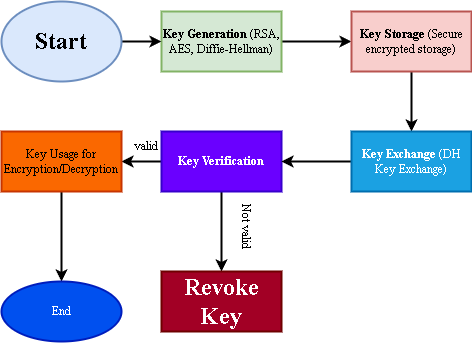

# Secure Key Management System (SKMS)

## **Overview**
The Secure Key Management System (SKMS) is designed to manage cryptographic keys securely, ensuring **key generation, storage, exchange, and revocation**. This system supports both **symmetric (AES)** and **asymmetric encryption (RSA, Diffie-Hellman)** to protect communication and data integrity.

## **Features**
- **Key Generation**: Secure creation of AES and RSA keys.
- **Key Storage**: Encrypted storage of cryptographic keys.
- **Key Exchange**: Secure key distribution using Diffie-Hellman.
- **Key Revocation**: Detection and invalidation of compromised keys.
- **Security Mechanisms**:
  - Digital Signatures for authentication.
  - PKI-based certificate validation.
  - Key rotation and automatic revocation.

## **System Architecture**
The SKMS consists of the following components:
- **Centralized Key Distribution** for symmetric encryption.
- **Public Key Infrastructure (PKI)** for asymmetric encryption.
- **Key Verification** to ensure authenticity.
- **Secure Storage** using encrypted databases.



## **Installation**
Ensure you have Python 3.8+ installed. Install the required dependencies using:

```bash
pip install -r requirements.txt
